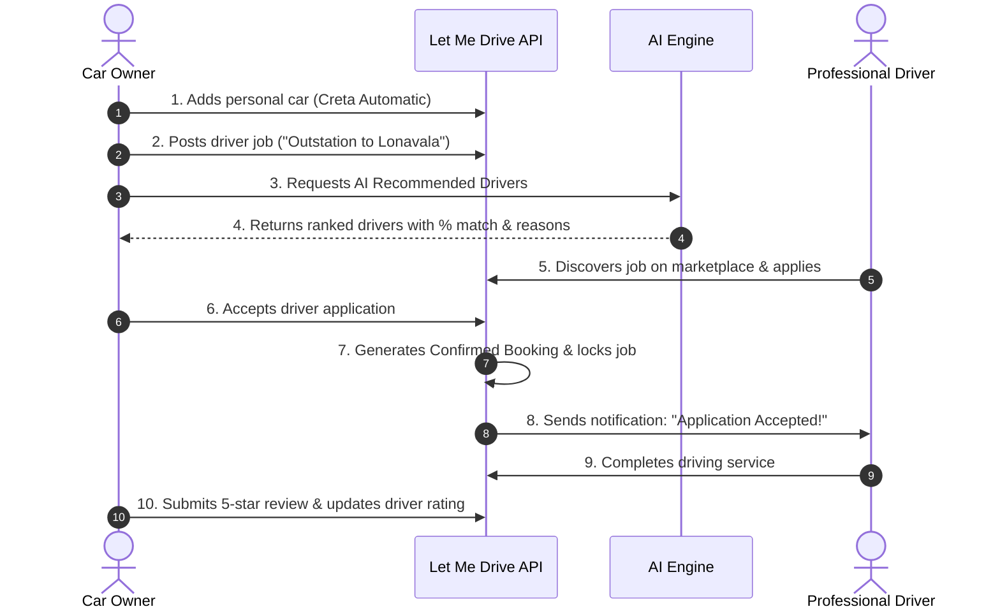

# 🚘 LET ME DRIVE - Professional Driver Marketplace

> **The Driver Hiring Platform for Personal Car Owners.**  
> *You own the car. They provide the driving skill.*

---

## 📌 Project Overview

**Let Me Drive** is a driver hiring marketplace designed to connect personal car owners with skilled, licensed, and verified professional drivers. 

### Key Problem Solved
- Many people own personal cars but do not want to drive in heavy traffic, need a relief driver for long outstation road trips, or require an on-demand chauffeur for a day or month.
- Many skilled, licensed drivers have excellent driving experience but do not own commercial vehicles.
- **Let Me Drive is NOT a taxi/cab aggregator (like Uber or Ola)**. The owner already owns the car; the driver provides only the professional driving service.

---

## 🚀 Key Features

### 👤 For Car Owners
- **Authentication & Security:** Register, login, and logout with JWT-based session security and bcryptjs password encryption.
- **Vehicle Garage Management:** Add, edit, and manage personal cars with transmission types (Manual/Automatic), fuel types (Petrol/Diesel/EV/CNG/Hybrid), and seating capacity.
- **Post Driver Requirements / Jobs:** Post driver jobs across various formats: *Outstation Trips, One Day Chauffeur, Temporary/Relief, Hourly, and Permanent Monthly*.
- **Browse & Filter Drivers:** View all registered drivers with rich filters by city, neighbourhood area, driving experience, license category, and availability.
- **✨ AI-Assisted Recommendation Engine:** Deterministic, explainable matching algorithm that computes a match percentage (0–100%) and explains *why* each driver is recommended (distance, experience, license match, job preference).
- **Application Review & 1-Click Hiring:** Review driver applications with proposed rates and cover notes. Accepting a driver instantly generates a confirmed booking and locks the job from double-booking.
- **Bookings & Rating System:** Track active/upcoming assignments, mark bookings completed, and submit 1–5 star reviews with feedback.

### 💼 For Professional Drivers
- **Driver Profile & Credentials:** Showcase driver license category (LMV, Commercial, HMV, Automatic Only, All), years of experience, specialized skills (Night driving, Luxury cars, Hill/Ghat sections), and current availability (*Available, Busy, On Leave*).
- **Job Marketplace:** Search and filter open driver jobs in your city or preferred format.
- **Apply with Custom Rate:** Submit applications with your expected salary and personal introduction note.
- **Application & Assignment Tracker:** Monitor application status (*Pending, Accepted, Rejected*), view confirmed bookings, and get car & route details.
- **Direct Ratings & Reviews:** Build professional reputation and client testimonials.

### 📍 Privacy-Preserving Location & Maps
- Powered by **Leaflet.js** and **OpenStreetMap** (100% Free — ₹0 cost, zero paid Google Maps API keys).
- Route visualizer connecting pickup and destination points.
- Privacy protection: Driver residential locations are displayed as approximate city/area radius to protect privacy.
- Integrated with browser Geolocation API with graceful city-level fallbacks.

---

## 🛠️ Technology Stack

| Component | Technology | Description |
|---|---|---|
| **Backend** | Node.js + Express.js | RESTful modular API with MVC architecture |
| **Database** | MongoDB Atlas (Free M0 Tier) | Cloud database with Mongoose ODM |
| **Authentication** | JWT + bcryptjs | Role-based access control (Car Owner & Driver) |
| **Frontend** | Vanilla HTML5, CSS3, JavaScript | Modern, fast, responsive UI (zero heavy frameworks) |
| **Maps** | Leaflet.js + OpenStreetMap | Free tile maps & route polylines |
| **AI Matching** | Deterministic Weighted Algorithm | Explainable 6-factor recommendation engine |
| **AI CLI Demo** | Python 3 | Standalone recommendation script for viva demo |

---

## 📁 Project Directory Structure

```text
D:\Let-Me-Drive
├── .env                     # Root environment variables (Excluded from git)
├── .gitignore               # Ignores node_modules, .env, and logs
├── README.md                # Project documentation
│
├── client/                  # Frontend Web Application
│   ├── index.html           # Landing page with marketplace explanation
│   ├── login.html           # Login page with demo quick-fill buttons
│   ├── register.html        # Role-based registration (Owner vs Driver)
│   ├── owner-dashboard.html # Car owner workspace (Cars, Jobs, Bookings, AI Recs)
│   ├── driver-dashboard.html# Driver workspace (Available jobs, Applications, Bookings)
│   ├── drivers.html         # All Drivers + AI Recommended Drivers
│   ├── jobs.html            # Public driver jobs marketplace with Leaflet maps
│   ├── profile.html         # Profile settings & GPS detection
│   ├── css/
│   │   ├── main.css         # Global design system & typography
│   │   ├── dashboard.css    # Dashboard stats, cards, and modal styles
│   │   └── drivers.css      # Driver cards, AI badges & filter sidebar
│   └── js/
│       ├── api.js           # Fetch wrapper & toast notification system
│       ├── auth.js          # Auth session guard & dynamic navigation bar
│       ├── notifications.js # In-app notification bell & real-time badge
│       └── maps.js          # Leaflet.js map helpers & GPS integration
│
├── server/                  # Backend REST API
│   ├── server.js            # Express app entrypoint & static client server
│   ├── package.json         # Node dependencies & npm scripts
│   ├── seed.js              # Realistic demo dataset population script
│   ├── test-api.js          # Automated verification test suite (19/19 tests)
│   ├── config/
│   │   └── db.js            # MongoDB Atlas connection with DNS resolver fix
│   ├── controllers/         # Business logic controllers
│   │   ├── authController.js
│   │   ├── userController.js
│   │   ├── driverController.js (Includes AI Recommendation Engine)
│   │   ├── carController.js
│   │   ├── jobController.js
│   │   ├── applicationController.js
│   │   ├── bookingController.js
│   │   ├── reviewController.js
│   │   └── notificationController.js
│   ├── middleware/          # Security & error handling
│   │   ├── auth.js          # JWT verification middleware
│   │   ├── role.js          # Role authorization guard
│   │   └── error.js         # Centralized error handler
│   ├── models/              # Mongoose database models
│   │   ├── User.js
│   │   ├── Car.js
│   │   ├── Job.js
│   │   ├── Application.js
│   │   ├── Booking.js
│   │   ├── Review.js
│   │   └── Notification.js
│   └── routes/              # Express API route modules
│
└── ai/                      # Companion Python AI Module
    ├── recommendation.py    # Python recommendation engine demo script
    └── requirements.txt     # Python requirements
```

---

## ⚙️ Environment Configuration

The application expects a `.env` file located at the **project root** (`D:\Let-Me-Drive\.env`):

```env
PORT=5000
MONGO_URI=mongodb+srv://<username>:<password>@cluster0.aqsaxsi.mongodb.net/let-me-drive?retryWrites=true&w=majority
JWT_SECRET=let_me_drive_super_secret_jwt_key_2026
```

> [!CAUTION]
> **Security Notice**: Never commit your `.env` file to Git. Rotate your MongoDB Atlas password before any public or production deployment.

---

## 💻 Local Setup & Running

### Prerequisites
- Node.js (v18 or newer)
- Python 3.9+ (optional, for standalone AI script)
- Internet connection (for MongoDB Atlas connection)

### 1. Install Backend Dependencies
```bash
cd D:\Let-Me-Drive\server
npm install
```

### 2. Seed Realistic Demo Data
To populate sample car owners, verified drivers, registered cars, and open jobs:
```bash
npm run seed
```

### 3. Run Automated API Test Suite
Verify that all 19 workflow tests pass:
```bash
npm run test-api
```

### 4. Start the Application Server
```bash
npm start
# OR for automatic reload during development:
npm run dev
```

The application will launch on:
👉 **`http://localhost:5000`**

Open this URL in your web browser. The frontend is served statically directly by the Express server.

---

## 🔑 Pre-Seeded Demo Accounts for Testing

All demo accounts use the standard password: **`Password@123`**

### Car Owners:
| Name | Email | City | Cars |
|---|---|---|---|
| Rahul Sharma | `owner.rahul@example.com` | Pune | Hyundai Creta Automatic, Honda City Manual |
| Priya Deshmukh | `owner.priya@example.com` | Mumbai | Toyota Innova Hycross Hybrid |
| Vikram Patel | `owner.vikram@example.com` | Bengaluru | Tata Nexon EV Automatic |

### Professional Drivers:
| Name | Email | City | Exp | License | Rating |
|---|---|---|---|---|---|
| Ramesh Pawar | `driver.ramesh@example.com` | Pune | 8 yrs | LMV | 4.9 ★ |
| Suresh Kumar | `driver.suresh@example.com` | Pune | 5 yrs | Commercial | 4.7 ★ |
| Sachin Shinde | `driver.sachin@example.com` | Mumbai | 12 yrs | HMV | 4.95 ★ |
| Amit Verma | `driver.amit@example.com` | Mumbai | 3 yrs | LMV | 4.4 ★ |
| Manjunath Swamy | `driver.manju@example.com` | Bengaluru | 9 yrs | All | 4.85 ★ |

*(Tip: On `login.html`, click any of the **Quick-Fill** buttons to log in instantly).*

---

## 🧠 Explainable AI Recommendation Algorithm

The AI recommendation engine uses a deterministic, weighted scoring algorithm:

$$\text{Match Score} = S_{\text{location}} + S_{\text{exp}} + S_{\text{rating}} + S_{\text{avail}} + S_{\text{license}} + S_{\text{pref}}$$

| Factor | Weight | Explanation |
|---|---|---|
| **Location Match** | **30%** | Same city & area (30 pts), nearby radius via Haversine distance ($\le 10$ km = 30 pts, $\le 25$ km = 25 pts), same city (25 pts). |
| **Experience Match** | **20%** | Exceeds requirement by 5+ years (20 pts), meets requirement (18 pts), or proportionally scaled. |
| **Driver Rating** | **15%** | Normalized from 5-star rating: $(\text{Rating} / 5) \times 15$. |
| **Availability** | **15%** | Immediately *Available* (15 pts), *Busy* (5 pts), *On Leave* (0 pts). |
| **License Compatibility** | **10%** | Matches or exceeds vehicle requirement (HMV/Commercial/All = 10 pts). |
| **Job Format Preference**| **10%** | Matches driver's preferred formats (Outstation, Daily, Hourly) (10 pts). |

### Companion Python Script Demo
You can demonstrate the AI algorithm in Python for a college presentation/viva:
```bash
cd D:\Let-Me-Drive
python ai/recommendation.py
```

---

## 🌐 Complete End-to-End Business Workflow



---

## ☁️ Zero-Cost (₹0) Free Deployment Guide

The application is engineered to run completely on **₹0 free tiers** with zero credit card requirements.

### Architecture:
```text
MongoDB Atlas Free Tier (M0)
            │
            ▼
Render.com / Railway Web Service (Free Tier)
  ├─ Express API (/api/*)
  └─ Static Frontend (client/)
```

### Steps to Deploy to Render.com:
1. Push this repository to GitHub (ensure `.env` is ignored by `.gitignore`).
2. Log in to [Render.com](https://render.com) (Free).
3. Click **New +** → **Web Service** → Connect your GitHub repository.
4. Set the following build and start configurations:
   - **Root Directory:** `server`
   - **Build Command:** `npm install`
   - **Start Command:** `npm start`
5. In the **Environment Variables** tab, add:
   - `PORT` = `10000`
   - `MONGO_URI` = `<Your MongoDB Atlas connection string>`
   - `JWT_SECRET` = `<Your secure secret string>`
   - `NODE_ENV` = `production`
6. Click **Deploy Web Service**.
7. Your app is live with SSL HTTPS at `https://let-me-drive.onrender.com`!

---

## 🔒 Security Summary
- Passwords hashed using salted `bcryptjs` (never stored as plain text).
- Secure stateless JWT authentication with token expiration.
- Protected API routes with role-based authorization (`authorize('owner')`, `authorize('driver')`).
- Strictly prevents duplicate applications to the same job.
- Prevents double-booking: once an application is accepted, the job is assigned and other pending applications are closed.
- Only car owners with completed bookings can review drivers (prevents fake reviews).
- Driver residential street addresses are kept private; only approximate radius and city/area are visible.
